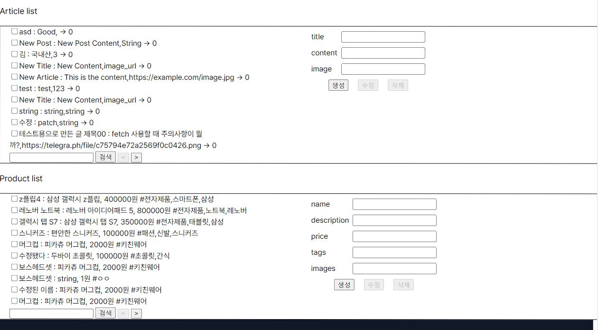
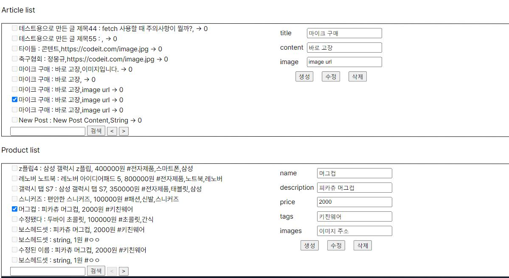

# 요구사항

## 기본
### 공통
- [] Github에 스프린트 미션 PR을 만들어 주세요.
- [] ‘https://sprint-mission-api.vercel.app/articles’ API를 이용하여 아래 함수들을 구현해 주세요.
-  - [] getArticleList() : GET 메서드를 사용해 주세요.
- - - [] page, pageSize, keyword 쿼리 파라미터를 이용해 주세요.
- -  [] getArticle() : GET 메서드를 사용해 주세요.
- -  [] createArticle() : POST 메서드를 사용해 주세요.
- - - [] request body에 title, content, image 를 포함해 주세요.
- - [] patchArticle() : PATCH 메서드를 사용해 주세요.
- - [] deleteArticle() : DELETE 메서드를 사용해 주세요.
- [] fetch를 이용해 주세요.
- - [] 응답의 상태 코드가 2XX가 아닐 경우, 에러메시지를 콘솔에 출력해 주세요.
- [] .then() 메서드를 이용하여 비동기 처리를 해주세요.
- [] .catch() 를 이용하여 오류 처리를 해주세요.
- [] ‘https://sprint-mission-api.vercel.app/products’ API를 이용하여 아래 함수들을 구현해 주세요.
- - [] getProductList() : GET 메서드를 사용해 주세요.
- - - [] page, pageSize, keyword 쿼리 파라미터를 이용해 주세요.
- - [] getProduct() : GET 메서드를 사용해 주세요.
- - [] createProduct() : POST 메서드를 사용해 주세요.
- - - [] request body에 name, description, price, tags, images 를 포함해 주세요.
- - [] patchProduct() : PATCH 메서드를 사용해 주세요.
- - [] deleteProduct() : DELETE 메서드를 사용해 주세요.
- [] axios를 이용해 주세요.
- [] async/await 을 이용하여 비동기 처리를 해주세요.
- [] try/catch 를 이용하여 오류 처리를 해주세요.
- [] 구현한 함수들을 아래와 같이 파일을 분리해 주세요.
- - [] export를 활용해 주세요.
- - [] ProductService.js 파일 Product API 관련 함수들을 작성해 주세요.
- - [] ArticleService.js 파일에 Article API 관련 함수들을 작성해 주세요.
- [] 이외의 코드들은 모두 main.js 파일에 작성해 주세요.
- - [] import를 활용해 주세요.
- - [] 각 함수를 실행하는 코드를 작성하고, 제대로 동작하는지 확인해 주세요.
## 주요 변경사항
- fetch 사용
- axios 사용

## 스크린샷

## 멘토에게
- 조건에 main.js에 모두 작성하라고 되어있어서 product, article 관련 이벤트와 함수를 한 번에 적었습니다. 현재는 이벤트와 함수가 작동하고 그 안에서 조건에 따라 product인지 article인지 구분해서 자료를 불러오고 있는데, 혹시 파일을 분리해서 이벤트와 함수를 아예 따로 작동하게 하면 자료를 불러오는 속도가 빨라질 수 있을까요? 
- 셀프 코드 리뷰를 통해 질문 이어가겠습니다.
